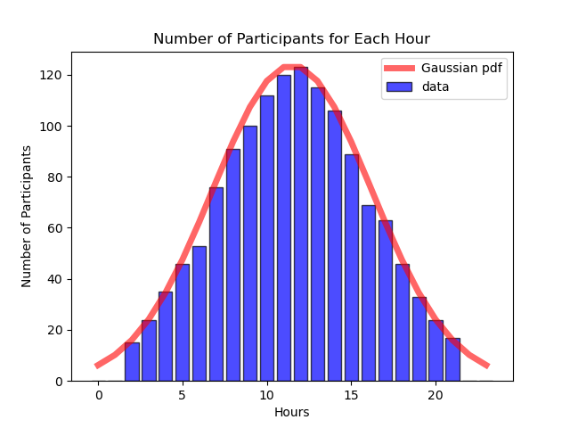
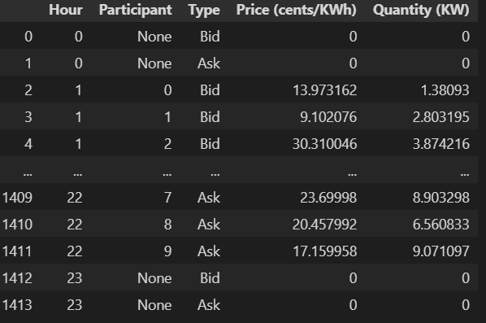

The code generates a set of transactions in 24 hours with hourly resolution. The number of transactions follow a Gaussian distribution over time.
The Gaussian distribution is specified with a peak transaction number of 123 and the lowest number of transactions are minimized in 10.
With this specification the pest fit is a Gaussian pdf with mean at 11.5 (on interval 0 to 23) and standard deviation of 4.7.
Most of the time when sampled from this specific distribution no transactions are present at hour 0 and 23 as they are below 10 due to the specific parameters of the Gaussian.
However, this can be tuned in the function in a self explanatory way.

Example data with the continous pdf (red):

The data comes in a dataframe and it looks as follows:

